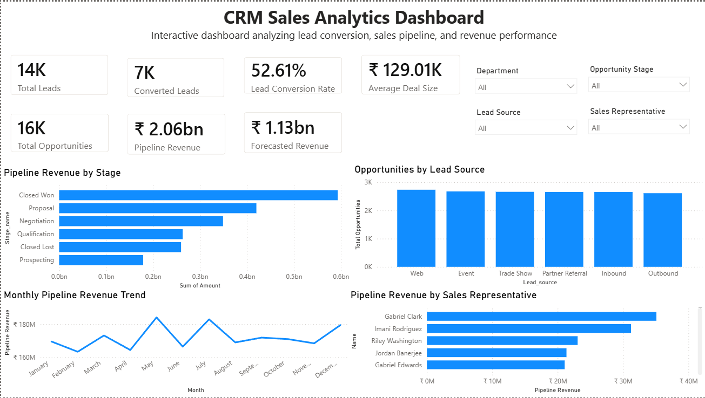
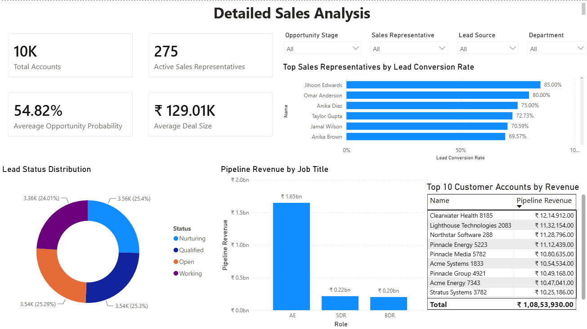
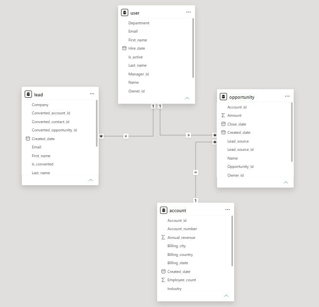

# CRM Sales Analytics Dashboard using Power BI

This project demonstrates how Power BI can be used to analyze CRM sales data and create interactive dashboards for business decision-making. The dashboard provides insights into lead conversion, sales pipeline performance, customer accounts, and salesperson productivity using interactive visualizations, KPIs, and slicers.

## Dashboard Review
### Executive Dashboard

### Detailed Sales Analysis

### Data Model

## Project Overview

The dashboard analyzes CRM sales data to answer key business questions such as:

- What is the lead conversion rate?
- Which sales representatives generate the highest pipeline revenue?
- Which opportunity stages contribute the most revenue?
- Which customer accounts generate the highest revenue?
- How does pipeline performance change over time?

## Dashboard Features

Executive Dashboard
- Total Leads
- Converted Leads
- Lead Conversion Rate
- Total Opportunities
- Pipeline Revenue
- Forecasted Revenue
- Average Deal Size
- Interactive Slicers

Detailed Sales Analysis
- Lead Conversion by Sales Representative
- Revenue by Job Title
- Top 10 Revenue Accounts
- Lead Status Distribution
- Average Opportunity Probability
- Average Deal Size

## Skills Demonstrated
- Power BI
- Power Query
- Data Modeling
- DAX Measures
- KPI Cards
- Interactive Dashboards
- Slicers
- Business Intelligence
- CRM Analytics
- Sales Analytics

## Technologies
- Microsoft Power BI
- DAX
- Power Query
- CSV Dataset

## About Me

**Dinky Vadera**

Aspiring Business Analyst with 4+ years of experience in Sales Operations, CRM Analytics, and Business Development. Passionate about transforming business data into actionable insights using SQL, Python, Excel, and Power BI.

📧 Email: dinkyvadera1502@gmail.com

💼 LinkedIn: https://www.linkedin.com/in/dinkyvadera1502/

🌐 GitHub: https://github.com/dinkyvadera1502-code
